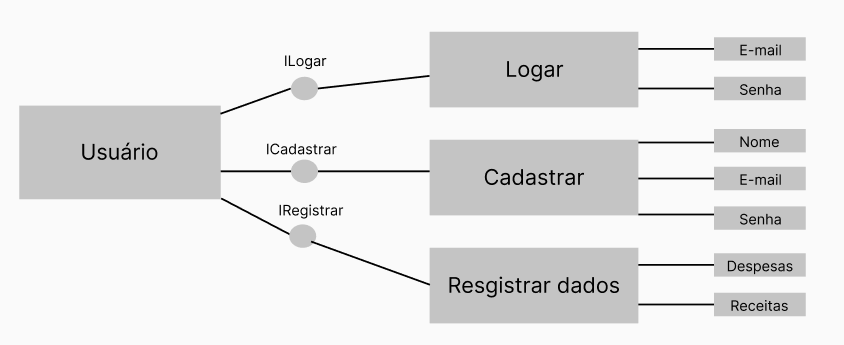
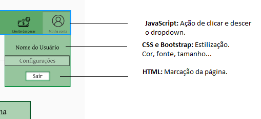

# Arquitetura da Solução

Pré-requisitos: <a href="3-Projeto de Interface.md"> Projeto de Interface</a>

Definição de como o software é estruturado em termos dos componentes que fazem parte da solução e do ambiente de hospedagem da aplicação.

## Diagrama de componentes

Diagrama que permite a modelagem física de um sistema, através da visão dos seus componentes e relacionamentos entre os mesmos.

Exemplo: 

Os componentes que fazem parte da solução são apresentados na Figura XX.

Figura XX - Arquitetura da Solução

A solução implementada conta com os seguintes módulos:
- **Navegador** - Interface básica do sistema  
  - **Páginas Web** - Conjunto de arquivos HTML, CSS, JavaScript e imagens que implementam as funcionalidades do sistema.
   - **Local Storage** - armazenamento mantido no Navegador, onde são implementados bancos de dados baseados em JSON. São eles: 
     - **Canais** - seções de notícias apresentadas 
     - **Comentários** - registro de opiniões dos usuários sobre as notícias
     - **Preferidas** - lista de notícias mantidas para leitura e acesso posterior
 - **News API** - plataforma que permite o acesso às notícias exibidas no site.
 - **Hospedagem** - local na Internet onde as páginas são mantidas e acessadas pelo navegador. 

Inclua um diagrama da solução e descreva os módulos e as tecnologias que fazem parte da solução. Discorra sobre o diagrama.

A imagem a seguir ilustra o fluxo do usuário em nossa solução. Assim que o usuário entra na plataforma, ele é apresentado à tela de login (Login Aplicação) onde ele é confrontado com a opção de entrada com e-mail e senha, se não obter um cadastro temos a (Cadastro de Novo Usuário) onde ele pode realizar o cadastro necessitando de nome, e-mail e a criação de uma senha.

Ao clicar em entrar na página (Login Aplicação) será exibido a tela principal (Painel de Controle) onde o usuário consegue visualizar seu saldo geral e os saldos por conta, além de conseguir verificar seus últimos lançamentos.

No dropdown (Minha Conta) ao clicar na opção (Configurações) temos Redefinição de senha, gerenciamento de contas e adicionar categorias, ao clicar em adicionar categorias abrirá a (tela Categorias) onde o usuário poderá adicionar até 10 categorias sendo 6 fixas, além de visualizar as categorias criadas

## Tecnologias Utilizadas

As ferramentas empregadas no projeto são:
1) Visual Studio Code
2) Figma
3) Linguagem: HTML, CSS, JavaScript.
4) Framework: Bootstrap

O editor de código foi escolhido porque achamos mais prático de manusear. Para prototipagem escolhemos o Figma, pois é a ferramenta mais utilizada. Decidimos usar essas linguagens por conhecermos melhor e a partir desse conhecimento implementar, além de utilizar o framework bootstrap para facilitar a criação do design. 

## Hospedagem

Explique como a hospedagem e o lançamento da plataforma foi feita.